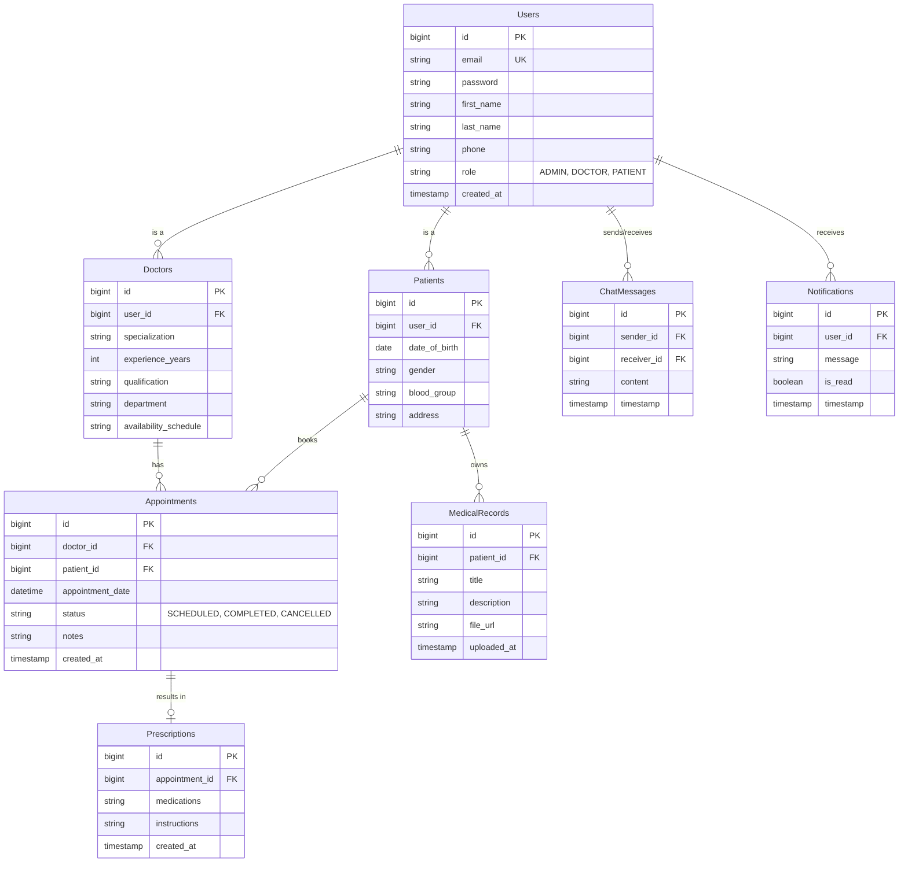

```mermaid
erDiagram
    Users ||--o{ Doctors : "is a"
    Users ||--o{ Patients : "is a"
    Users ||--o{ ChatMessages : "sends/receives"
    Users ||--o{ Notifications : "receives"
    
    Doctors ||--o{ Appointments : "has"
    Patients ||--o{ Appointments : "books"
    Patients ||--o{ MedicalRecords : "owns"
    
    Appointments ||--o| Prescriptions : "results in"

    Users {
        bigint id PK
        string email UK
        string password
        string first_name
        string last_name
        string phone
        string role "ADMIN, DOCTOR, PATIENT"
        timestamp created_at
    }

    Doctors {
        bigint id PK
        bigint user_id FK
        string specialization
        int experience_years
        string qualification
        string department
        string availability_schedule
    }

    Patients {
        bigint id PK
        bigint user_id FK
        date date_of_birth
        string gender
        string blood_group
        string address
    }

    Appointments {
        bigint id PK
        bigint doctor_id FK
        bigint patient_id FK
        datetime appointment_date
        string status "SCHEDULED, COMPLETED, CANCELLED"
        string notes
        timestamp created_at
    }

    Prescriptions {
        bigint id PK
        bigint appointment_id FK
        string medications
        string instructions
        timestamp created_at
    }

    MedicalRecords {
        bigint id PK
        bigint patient_id FK
        string title
        string description
        string file_url
        timestamp uploaded_at
    }

    ChatMessages {
        bigint id PK
        bigint sender_id FK
        bigint receiver_id FK
        string content
        timestamp timestamp
    }

    Notifications {
        bigint id PK
        bigint user_id FK
        string message
        boolean is_read
        timestamp timestamp
    }
```
